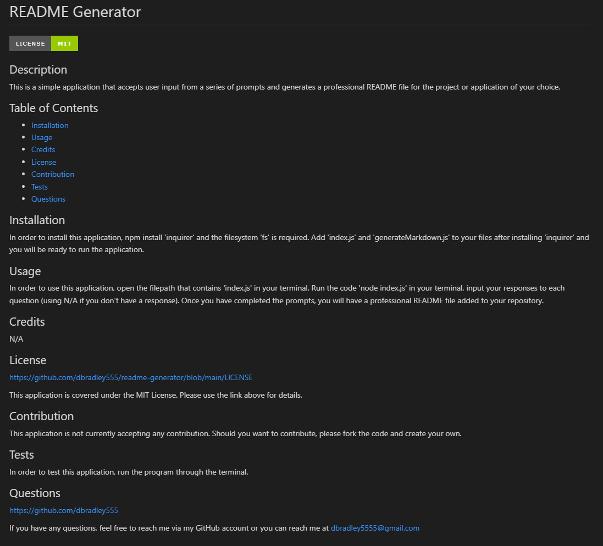

# README Generator

## Description

This is a simple application that accepts user input from a series of prompts and generates a professional README file for the project or application of your choice.

## Table of Contents

- [Installation](#installation)
- [Usage](#usage)
- [Credits](#credits)
- [License](#license)
- [Contribution](#contribution)
- [Tests](#tests)
- [Questions](#questions)

## Installation

In order to install this application, npm install 'inquirer' and the filesystem 'fs' is required. Add 'index.js' and 'generateMarkdown.js' to your files after installing 'inquirer' and you will be ready to run the application.

## Usage

In order to use this application, open the filepath that contains 'index.js' in your terminal. Run the code 'node index.js' in your terminal, input your responses to each question (using N/A if you don't have a response). Once you have completed the prompts, you will have a professional README file added to your repository.

Video Walkthrough: https://watch.screencastify.com/v/qHbMfBJSNeQ37HnmmNuK

## Credits

N/A

## License

https://github.com/dbradley555/readme-generator/blob/main/LICENSE

This application is covered under the MIT License. Please use the link above for details.

## Contribution

This application is not currently accepting any contribution. Should you want to contribute, please fork the code and create your own.

## Tests

In order to test this application, run the program through the terminal.

## Questions

https://github.com/dbradley555

If you have any questions, feel free to reach me via my GitHub account or you can reach me at
dbradley5555@gmail.com
